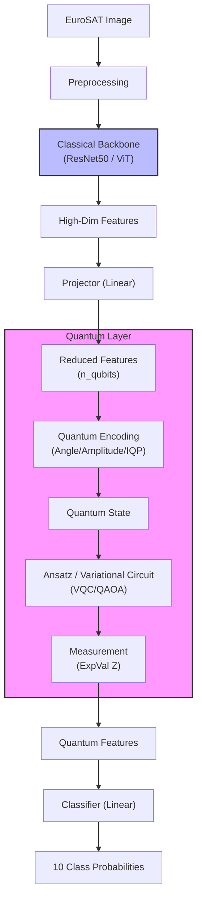
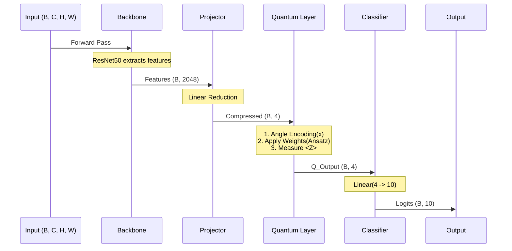

# Hybrid Quantum-Classical Model Architecture

This document describes the architecture, parameters, and data flow of the Hybrid Quantum-Classical model used for geospatial classification (EuroSAT).

## 1. High-Level Architecture

The system is a hybrid neural network that combines a pre-trained classical backbone (ResNet50 or ViT) with a helper quantum layer (VQC, QAOA, or QLSTM). The goal is to leverage quantum circuits for feature processing before the final classification.

### Components:
1.  **Input Data**: EuroSAT satellite images (RGB or Multispectral).
2.  **Backbone**: A classical Deep Neural Network (ResNet50 or ViT) pretrained on ImageNet. It acts as a feature extractor.
3.  **Projector**: A classical Linear layer that reduces the high-dimensional features from the backbone to a dimension suitable for the quantum circuit (usually equal to the number of qubits, or $2^n$ for amplitude encoding).
4.  **Quantum Layer**:
    *   **Encoding**: Converts classical data into a quantum state (Angle, Amplitude, or IQP encoding).
    *   **Ansatz**: A parameterized quantum circuit (Variational Quantum Circuit, QAOA, or StronglyEntanglingLayers) that processes the information.
    *   **Measurement**: Measures the expectation values of Pauli-Z operators on each qubit.
5.  **Classifier**: A final classical Linear layer that maps the quantum measurements to the class probabilities (10 classes for EuroSAT).

## 2. Mermaid Diagrams

### System Architecture

### Data Flow & Tensor Shapes

Assuming `batch_size=B`, `n_qubits=4`, ResNet50 backbone.

## 3. Key Parameters

### Configuration (`CONFIGS` in `run_experiments.py`)

| Parameter | Description | Examples |
| :--- | :--- | :--- |
| **`active_backbone`** | The classical pre-trained model used. | `resnet50`, `vit_base` |
| **`n_qubits`** | Number of qubits in the quantum circuit. Controls the dimensionality of the quantum layer. | `4` (default) |
| **`n_qlayers`** | Depth of the variational quantum circuit (number of repeated layers). | `1` (default) |
| **`encoding`** | Method to map classical data to quantum states. | `angle` (RX rotations), `amplitude` (AmplitudeEmbedding), `iqp` (IQPEmbedding) |
| **`ansatz`** | Structure of the parameterized quantum circuit. | `vqc` (StronglyEntangling), `qaoa`, `qlstm` |
| **`q_type`** | Type of quantum integration. | `standard` (VQC/QAOA), `qlstm` (Quantum LSTM) |

### Training Parameters

*   **Batch Size**: 32 (default)
*   **Learning Rate**: 1e-4
*   **Epochs**: 5
*   **Optimizer**: Adam
*   **Loss Function**: CrossEntropyLoss

## 4. Flow of Data Implementation Details

1.  **Loading**: Images are loaded from `data/EuroSAT` and transformed (resized to 224x224).
2.  **Hybrid Model (`HybridGeoModel`)**:
    *   The `backbone` returns a feature vector (e.g., 2048 for ResNet).
    *   The `projector` linear layer shrinks this to `n_qubits` (e.g., 4) or `2^n_qubits` (16) if using amplitude encoding.
    *   **Quantum Forward**:
        *   **Angle Encoding**: The 4 features are used as rotation angles for RX gates on the 4 qubits.
        *   **Ansatz**: Weights (learnable parameters) are applied using potentially entangled layers.
        *   **Measurement**: We get 4 values (expectation of Z on each qubit).
    *   The `classifier` takes these 4 values and produces 10 logits.
3.  **Optimization**: PyTorch backpropagates through the classical layers and uses parameter-shift or finite-diff (handled by PennyLane/Torch interface) to update quantum circuit parameters if they are trainable.

