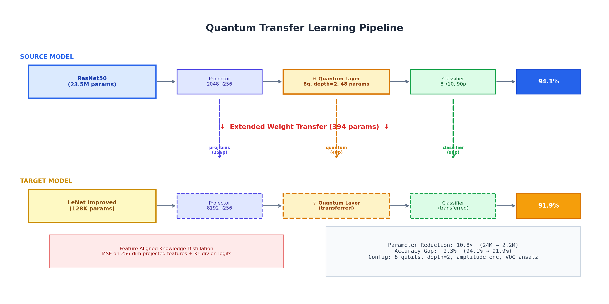
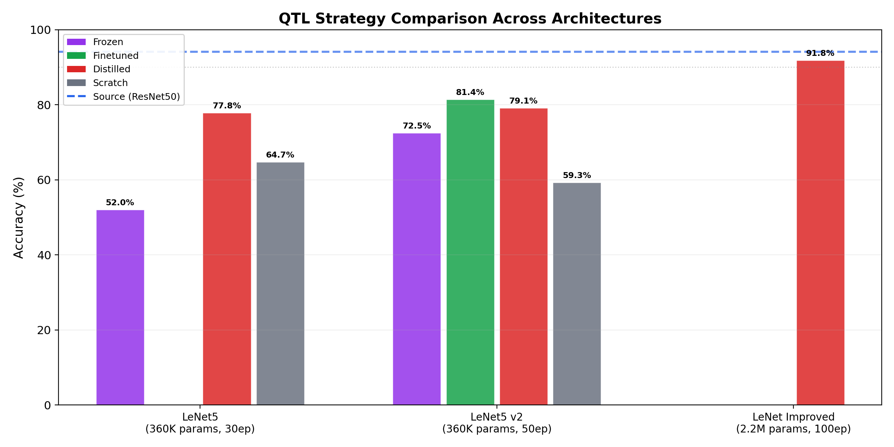
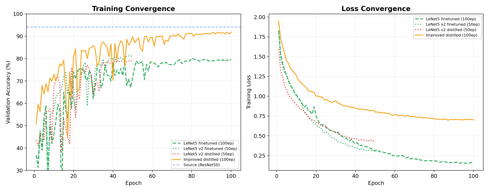
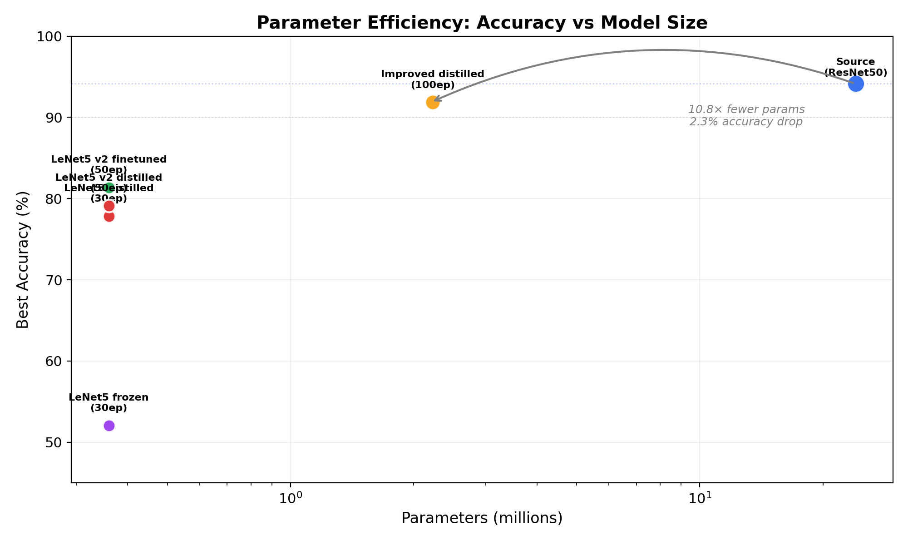

# Quantum Transfer Learning — Full Analysis Report

> Generated from experiments on the EuroSAT 10-class satellite image dataset.

---

## Why ResNet50 as the Source Model?

QTL requires the **source model to be as accurate as possible** — it's the "teacher" whose knowledge we're compressing into the smaller target. ResNet50 was chosen for three reasons:

1. **Best available accuracy on EuroSAT (94.1%)** — The source model's accuracy is the upper bound for transfer. A stronger teacher produces better soft labels and features for distillation. ResNet50 with ImageNet pre-training gives rich, general-purpose visual features that transfer well to satellite imagery.

2. **ImageNet pre-training provides generalizable features** — ResNet50's convolutional filters (trained on 1.2M natural images) extract edges, textures, and shapes that are useful even for satellite land-use classification. This means the quantum circuit on top learns on already high-quality features, producing quantum weights worth transferring.

3. **Standardized 256-dim interface enables transfer** — By using `standard_dim=256`, both ResNet50 (2048→256 projector) and LeNet Improved (8192→256 projector) produce the same 256-dim vector before the quantum layer. This makes the quantum weights (48 params), classifier (90 params), and projector bias (256 params) **directly transferable** regardless of backbone.

> **The key insight**: We're not transferring ResNet50 itself — we're using it to train the best possible quantum circuit, then transferring that quantum circuit to a smaller model.

| Why ResNet50? | Alternative | Problem |
|---------------|-------------|---------|
| 94.1% accuracy | ResNet18 (88-90%) | Weaker teacher = worse transfer ceiling |
| ImageNet pre-trained | Random init | Would need many more epochs to learn useful features |
| 2048-dim features | ViT (768-dim) | More complex, harder to deploy, similar accuracy |

---

## Architecture Overview



### What is Quantum Transfer Learning (QTL)?

QTL transfers **pre-trained quantum circuit weights** from a large, accurate source model to a smaller, efficient target model. The core idea: the quantum circuit learns **task-general quantum features** on the source that can be reused on the target, even with a completely different backbone.

### Source Model — ResNet50 + Quantum

| Component | Details | Params |
|-----------|---------|-------:|
| **Backbone** | ResNet50 (ImageNet pre-trained) | 23.5M |
| **Projector** | Linear(2048 → 256) | 524K |
| **Quantum Layer** | 8 qubits, depth 2, amplitude encoding, VQC ansatz | 48 |
| **Classifier** | Linear(8 → 10) | 90 |
| **Total** | | **24.0M** |
| **Accuracy** | 94.1% val / 94.4% test | |

**Data flow**: Image → ResNet50 extracts 2048-dim features → Projector maps to 256-dim → L2-normalized for amplitude encoding → Quantum circuit processes through 8 qubits → Produces 8-dim output → Classifier maps to 10 classes.

**Amplitude encoding**: Input vector is encoded as quantum state amplitudes. Requires `2^n = 256` input dimensions for `n = 8` qubits. This is why `standard_dim = 256`.

### Target Model — LeNet Improved + Quantum

| Component | Details | Params |
|-----------|---------|-------:|
| **Backbone** | LeNetCNNImproved (3-conv, BatchNorm) | 128K |
| **Projector** | Linear(8192 → 256) | 2.1M |
| **Quantum Layer** | 8 qubits, depth 2 (transferred from source) | 48 |
| **Classifier** | Linear(8 → 10) (transferred from source) | 90 |
| **Total** | | **2.2M** |

---

## Transfer Mechanism — Extended Weight Transfer

We transfer **394 parameters** from the trained source to the target:

```
Source (ResNet50)              Target (LeNet Improved)
─────────────────             ────────────────────────
Projector bias (256p)    ──→  Projector bias (256p)       ✓ same shape
Quantum weights (48p)    ──→  Quantum weights (48p)       ✓ same shape
Classifier (90p)         ──→  Classifier (90p)            ✓ same shape
Projector weights (2048×256)  Projector weights (8192×256) ✗ different shape
```

### Four Transfer Strategies

| Strategy | Transfer | Freeze | Distillation | Purpose |
|----------|----------|--------|--------------|---------|
| **frozen** | quantum + classifier + proj_bias | Yes, permanently | No | Baseline: raw transfer value |
| **finetuned** | quantum + classifier + proj_bias | Epochs 1–5, then unfreeze | No | Transfer + adaptation |
| **distilled** | quantum + classifier + proj_bias | No | Feature-aligned KD | Best strategy: teacher guidance |
| **scratch** | None | N/A | No | Control: no transfer at all |

### Feature-Aligned Knowledge Distillation (distilled strategy)

The distilled strategy uses a **three-component loss**:

```
Total Loss = 0.3 × KD_loss + 0.2 × Feature_loss + 0.5 × CE_loss
```

| Component | Formula | Purpose |
|-----------|---------|---------|
| **CE loss** | CrossEntropy(student_logits, labels) with label_smoothing=0.1 | Learn correct classification |
| **KD loss** | KL(student_softmax / T, teacher_softmax / T) × T² | Match teacher's soft predictions |
| **Feature loss** | MSE(student_proj_256d, teacher_proj_256d) | Align feature spaces at 256-dim |

**Temperature T = 2.0**: Lower temperature gives sharper soft targets, transferring more discriminative information.

---

## Training Improvements

| Improvement | Before | After | Why |
|-------------|--------|-------|-----|
| **Data augmentation** | None | RandomFlip + Rotation(15°) | Improve generalization |
| **LR schedule** | Cosine from epoch 0 | 10-epoch warmup → cosine | Stabilize early training |
| **Label smoothing** | 0.0 | 0.1 | Prevent overconfident predictions |
| **Weight decay** | 0.0 | 1e-5 | L2 regularization |

---

## Results

### Accuracy Comparison



### Full Results Table

| Experiment | Strategy | Backbone | Params | Epochs | Best Acc | Best F1 |
|------------|----------|----------|-------:|-------:|---------:|--------:|
| **Source** | — | ResNet50 | 24.0M | — | **94.1%** | 94.2% |
| Round 1 | frozen | LeNet5 | 360K | 30 | 52.0% | 44.0% |
| Round 2 | finetuned | LeNet5 | 360K | 100 | 80.1% | 78.9% |
| Round 3 | distilled | LeNet5 | 360K | 30 | 77.8% | 76.6% |
| Round 4 | scratch | LeNet5 | 360K | 30 | 64.7% | 58.9% |
| Round 5 | frozen | LeNet5 | 360K | 50 | 72.5% | 71.2% |
| Round 6 | finetuned | LeNet5 | 360K | 50 | 81.4% | 80.2% |
| Round 7 | distilled | LeNet5 | 360K | 50 | 79.1% | 78.1% |
| Round 8 | scratch | LeNet5 | 360K | 50 | 59.3% | 52.0% |
| **Round 9** | **distilled** | **LeNet Improved** | **2.2M** | **100** | **91.9%** | **91.6%** |

### Training Convergence



### Parameter Efficiency



---

## Key Findings

### 1. QTL transfer works — distilled is the best strategy

| Strategy | Best Accuracy | vs Scratch |
|----------|:------------:|:----------:|
| distilled (R9) | **91.9%** | **+32.6%** |
| finetuned  | 81.4% | +22.1% |
| frozen  | 72.5% | +13.2% |
| scratch | 59.3% | baseline |

### 2. Backbone capacity matters more than quantum layer size

The quantum layer has only **48 parameters** (0.002% of the model). Performance is dominated by the backbone:
- LeNet5 (84-dim features) → 81.4% best
- LeNet Improved (8192-dim features) → **91.9% best**

### 3. Parameter reduction of 10.8×

| Model | Params | Accuracy | Reduction |
|-------|-------:|---------:|----------:|
| Source (ResNet50) | 24.0M | 94.1% | 1× |
| Target (LeNet Improved) | 2.2M | 91.9% | **10.8×** |
| Accuracy gap | | **2.2%** | |

---

### 1. Hybrid Model Architecture (the core building block)

**File**: [hybrid_model.py](file:///home/madhav/projects/Quantum/src/models/hybrid_model.py)

This is the heart of the system — both source and target models are instances of this class.

| What to show | Lines | What it does |
|---|---|---|
| [\_\_init\_\_](file:///home/madhav/projects/Quantum/src/models/hybrid_model.py#L9-L72) | 9–72 | Creates the 4-component pipeline: backbone → projector → quantum → classifier |
| [forward](file:///home/madhav/projects/Quantum/src/models/hybrid_model.py#L75-L108) | 75–108 | Shows the full data flow including amplitude normalization |

**Key points to explain:**
- L30: `self.projector = nn.Linear(feature_dim, self.projector_out)` — this is what bridges different backbones to the same 256-dim space
- L88-90: Amplitude encoding normalization (`norm = torch.norm(...)`) — required because quantum amplitudes must sum to 1
- L55: `self.quantum_layer = QuantumLayer(...)` — the PennyLane quantum circuit

---

### 2. Quantum Circuit (the transferable component)

**File**: [quantum_layers.py](file:///home/madhav/projects/Quantum/src/models/quantum_layers.py)

| What to show | Lines | What it does |
|---|---|---|
| [\_\_init\_\_](file:///home/madhav/projects/Quantum/src/models/quantum_layers.py#L10-L43) | 10–43 | Creates PennyLane quantum device and defines the circuit |
| [_apply_encoding](file:///home/madhav/projects/Quantum/src/models/quantum_layers.py#L45-L59) | 45–59 | Amplitude encoding: `qml.AmplitudeEmbedding(features=inputs, ...)` |
| [_apply_ansatz](file:///home/madhav/projects/Quantum/src/models/quantum_layers.py#L61-L78) | 61–78 | VQC ansatz: `qml.StronglyEntanglingLayers(weights, ...)` |
| [save_quantum_weights](file:///home/madhav/projects/Quantum/src/models/quantum_layers.py#L83-L99) | 83–99 | Saves weights + architecture metadata for transfer |
| [load_quantum_weights](file:///home/madhav/projects/Quantum/src/models/quantum_layers.py#L101-L127) | 101–127 | Loads weights with strict compatibility checking |

**Key points to explain:**
- L30-39: The quantum circuit definition — encoding → ansatz → measurement
- L56: `qml.AmplitudeEmbedding` — encodes 256-dim vector as amplitudes of 8 qubits (2⁸ = 256)
- L63: `qml.StronglyEntanglingLayers` — the VQC ansatz with trainable rotation gates
- Weight shape: `(n_layers=2, n_qubits=8, 3)` = 48 trainable parameters

---

### 3. Backbone Factory (why ResNet50 and LeNet Improved)

**File**: [backbones.py](file:///home/madhav/projects/Quantum/src/models/backbones.py)

| What to show | Lines | What it does |
|---|---|---|
| [ResNet50 creation](file:///home/madhav/projects/Quantum/src/models/backbones.py#L30-L50) | 30–50 | `models.resnet50(pretrained=True)`, removes classification head, outputs 2048-dim |
| [LeNet Improved creation](file:///home/madhav/projects/Quantum/src/models/backbones.py#L66-L70) | 66–70 | `LeNetCNNImproved(...)`, outputs 8192-dim |

**Key point**: Both backbones feed into the SAME `HybridGeoModel`. The projector (`nn.Linear(feature_dim, 256)`) adapts any backbone's output to the fixed 256-dim quantum input.

---

### 4. LeNet Improved Backbone

**File**: [lenet_improved.py](file:///home/madhav/projects/Quantum/src/models/lenet_improved.py#L87-L150)

| What to show | Lines | What it does |
|---|---|---|
| [LeNetCNNImproved class](file:///home/madhav/projects/Quantum/src/models/lenet_improved.py#L87-L150) | 87–150 | 3 conv layers + BatchNorm + Dropout, produces 8192-dim features |

**Key point**: This is a lightweight CNN (128K params) that replaces ResNet50 (23.5M params). The 3-conv architecture with BatchNorm provides richer features than LeNet5's 84-dim output.

---

### 5. Extended Weight Transfer (the QTL mechanism)

**File**: [lenet_improved_qtl.py](file:///home/madhav/projects/Quantum/qtl/lenet_improved_qtl.py)

| What to show | Lines | What it does |
|---|---|---|
| [Source & Target configs](file:///home/madhav/projects/Quantum/qtl/lenet_improved_qtl.py#L60-L98) | 60–98 | Side-by-side configs showing same quantum config, different backbone |
| [save_extended_weights](file:///home/madhav/projects/Quantum/qtl/lenet_improved_qtl.py#L101-L133) | 101–133 | Extracts the 394 transferable params from source |
| [load_extended_weights](file:///home/madhav/projects/Quantum/qtl/lenet_improved_qtl.py#L136-L172) | 136–172 | Loads them into target + optional freezing |
| [build_source_model](file:///home/madhav/projects/Quantum/qtl/lenet_improved_qtl.py#L179-L196) | 179–196 | Creates ResNet50 + Quantum (the teacher) |
| [build_target_model](file:///home/madhav/projects/Quantum/qtl/lenet_improved_qtl.py#L199-L221) | 199–221 | Creates LeNet Improved + Quantum (the student) |

**Key points to explain:**
- L101-133: `save_extended_weights` — saves `quantum_weights`, `classifier_weight`, `classifier_bias`, `projector_bias` into one checkpoint
- L136-172: `load_extended_weights` — loads them onto the correct device, with option to freeze transferred components

---

### 6. Feature-Aligned Distillation (the training wrapper)

**File**: [lenet_improved_qtl.py](file:///home/madhav/projects/Quantum/qtl/lenet_improved_qtl.py)

| What to show | Lines | What it does |
|---|---|---|
| [FeatureAlignedQTL class](file:///home/madhav/projects/Quantum/qtl/lenet_improved_qtl.py#L241-L270) | 241–270 | Wraps student + teacher, defines α, β, T |
| [_get_projected_features](file:///home/madhav/projects/Quantum/qtl/lenet_improved_qtl.py#L276-L283) | 276–283 | Extracts 256-dim projector output (skips quantum+classifier) |
| [distillation_loss](file:///home/madhav/projects/Quantum/qtl/lenet_improved_qtl.py#L285-L319) | 285–319 | **The three-component loss**: CE + KD + feature MSE |
| [get_param_groups](file:///home/madhav/projects/Quantum/qtl/lenet_improved_qtl.py#L348-L392) | 348–392 | Differential LRs: backbone=1e-3, quantum=1e-5 |

**Key points to explain:**
- L302-304: `soft_student / soft_teacher` — temperature-scaled softmax for KD
- L305: `kd_loss = F.kl_div(...)` — Kullback-Leibler divergence between soft predictions
- L310: `feature_loss = F.mse_loss(student_features, teacher_features)` — aligns 256-dim spaces
- L313: `total_loss = alpha * kd_loss + beta * feature_loss + (1-alpha-beta) * hard_loss`

---

### 7. Training Loop & Augmentation

**File**: [lenet_improved_qtl.py](file:///home/madhav/projects/Quantum/qtl/lenet_improved_qtl.py)

| What to show | Lines | What it does |
|---|---|---|
| [Augmentation pipeline](file:///home/madhav/projects/Quantum/qtl/lenet_improved_qtl.py#L445-L455) | 445–455 | Geometric-only transforms (safe for satellite value ranges) |
| [train_one_epoch](file:///home/madhav/projects/Quantum/qtl/lenet_improved_qtl.py#L458-L496) | 458–496 | Training loop with optional augmentation + distillation |
| [run_transfer_strategy](file:///home/madhav/projects/Quantum/qtl/lenet_improved_qtl.py#L653-L805) | 653–805 | Full strategy runner: builds model, loads weights, trains, evaluates |

---

## Reproduce

```bash
# Generate charts
python reports/generate_qtl_charts.py

# Re-run best configuration (distilled, 100 epochs)
python qtl/lenet_improved_qtl.py --epochs 100 --strategies distilled
```
